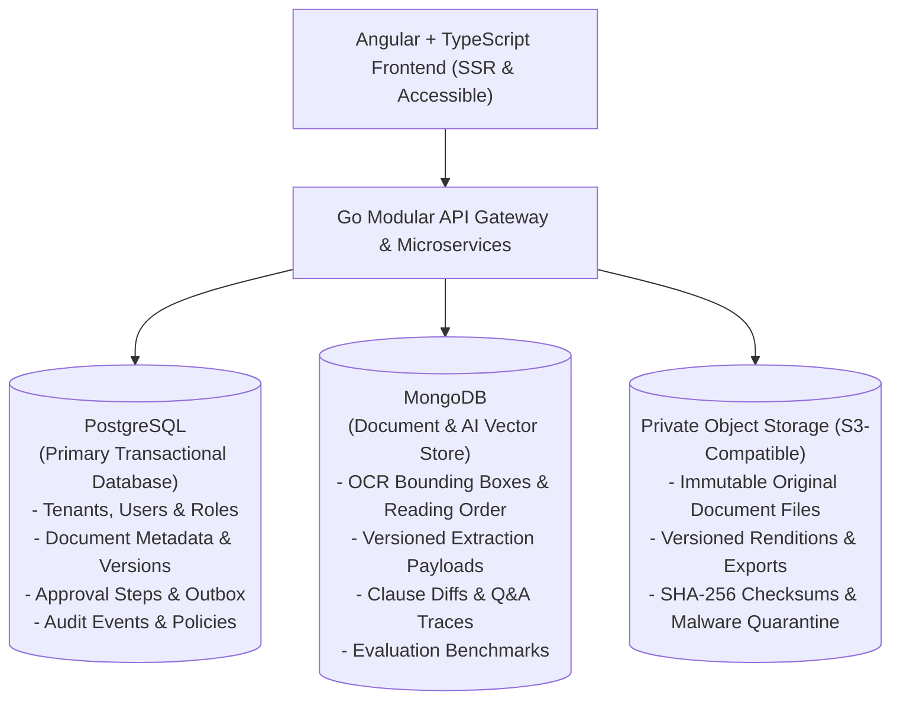
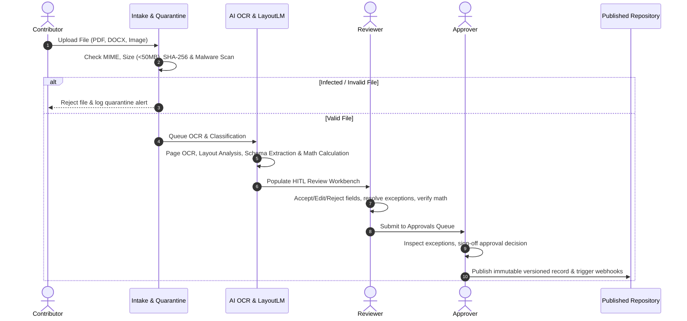
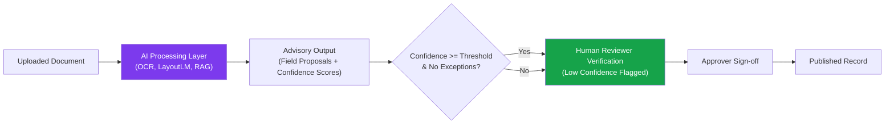

# Document Intelligence Platform — Comprehensive BRD Analysis & System Architecture Reference

## 1. Executive Summary & Purpose

### **What is the Document Intelligence Platform?**
The **Document Intelligence Platform** is an enterprise-grade, multi-tenant SaaS platform designed to automate the intake, OCR, classification, extraction, human verification, comparison, search, and approval of unstructured business documents (such as supplier contracts, purchase invoices, and internal corporate policies).

### **Why is it Used? (Business Context & Purpose)**
Organizations daily receive thousands of contracts, invoices, forms, and compliance documents through fragmented channels (email attachments, manual web uploads, external API integrations). Managing these manually results in:
1. **High Operational Cost & Human Errors**: Manual data entry of line items, invoice totals, and key dates is slow and prone to arithmetic mistakes.
2. **Lack of Traceability & Audit Gaps**: Difficulty tracking who edited a field, when an exception was overridden, or who approved a contract version.
3. **Risk of Fraud & Duplication**: Risk of paying duplicate invoices or accepting unauthorized contract deviations.
4. **Information Silos**: Difficulty comparing historical contract versions or retrieving specific clauses quickly.

### **Key Outcomes & Proposed Targets (Section 1)**
- ⚡ **Less Manual Entry**: Reduce median reviewer time per document and maximize percentage of fields accepted without correction.
- 🎯 **Accurate Records**: Field-level extraction precision/recall with deterministic arithmetic reconciliation.
- 🛡️ **Controlled Approvals**: 100% of published records backed by required approvals, separation of duties, and complete version history.
- 🔍 **Trustworthy Answers**: Grounded AI Q&A with mandatory page/span-level citations and strict abstentions when evidence is missing.

---

## 2. Multi-Tenant Architecture & System Technology Stack (Section 9)

The platform utilizes a modern, decoupled dual-database architecture:

### **Core Stack Components**
- **Frontend Layer**: Angular & TypeScript standalone architecture (role-based, accessible, dark mode/rich UI, draft preservation, responsive).
- **Backend API Layer**: Go (Golang) modular services handling business logic, state machines, workflow routing, and transactional outbox events.
- **Primary Relational Store (PostgreSQL)**: Source of truth for tenant accounts, user permissions, document metadata, version states, approval logs, and audit trails.
- **Document & Vector Store (MongoDB)**: Stores high-volume OCR layouts, bounding box coordinates, extracted JSON payloads, semantic clause diffs, and RAG embeddings.
- **Binary Storage**: S3-compatible private object store for immutable file storage, encrypted at rest.

---

## 3. User Roles & Permission Matrix (Section 3 & 13)

The platform enforces strict tenant boundary isolation and 6 granular user roles:

| Role | Primary Allowed Actions | Boundary / Scope |
| :--- | :--- | :--- |
| **Platform Operator** | Provision tenants, monitor pipeline health, inspect system metrics & job retries | No routine access to tenant document contents |
| **Organization Admin** | Manage tenant users, assign roles, configure document schemas, validation rules & approval routes | Own tenant organization scope only |
| **Uploader / Contributor** | Upload files via web drag-and-drop or email/API, view own submitted document status | Cannot approve documents or perform global exports |
| **Reviewer** | Side-by-side human verification, field editing, exception resolution, OCR manual entry & clarification requests | Assigned document types and assigned workspaces only |
| **Approver** | Review verified documents, inspect exceptions, approve/reject/return for changes, publish final records | Assigned approval steps; enforced separation of duties |
| **Auditor / Reader** | Search metadata & full-text, view approved documents, perform side-by-side comparisons, ask AI Q&A | Read-only scope with sensitive field masking rules |

---

## 4. End-to-End Lifecycle Workflows (Section 4)

---

## 5. Document Type Schemas & Business Rules (Section 6)

The initial system baselines 3 core document types:

### 1. **Purchase Invoice**
- **Core Fields**: Supplier Name, Supplier GSTIN / Tax ID, Invoice Number, Invoice Date, Payment Due Date, Currency, Line Items (Description, HSN Code, Quantity, Unit Price, Tax Rate, Line Total), Subtotal, Total Tax, Grand Invoice Total, PO Reference.
- **Deterministic Validation Focus**:
  - Line items sum validation: $\text{Line Total} = \text{Quantity} \times \text{Unit Price}$.
  - Grand total validation: $\text{Grand Total} = \text{Subtotal} + \text{Total Tax (18\% IGST)}$.
  - Mismatch flags an **Arithmetic Exception**.
  - Historical reference check flags **Duplicate Invoice Exception** if reference already exists.

### 2. **Supplier Contract**
- **Core Fields**: Contract Title, Primary Vendor (Party A), Client Entity (Party B), Effective Start Date, Expiration Date, Auto-Renewal Notice Period, Governing Jurisdiction, Maximum Liability & Penalty Cap, Signatories.
- **Validation Focus**:
  - Chronology validation: Effective Start Date must precede Expiration Date.
  - Clause diffing: Side-by-side comparison against prior contract versions to highlight added, removed, or modified risk clauses.

### 3. **Internal Policy**
- **Core Fields**: Policy Document ID, Policy Title, Department Owner, Version Control Number, Effective Publication Date, Security Classification (Public / Internal / Confidential), Review Frequency, Compliance Officer.
- **Validation Focus**:
  - Supersession tracking: Ensures new policy version explicitly supersedes earlier versions upon publication.

---

## 6. Functional Requirements Breakdown (FR Catalog)

### **Intake & Multi-Tenant Management**
- **FR-001 (Must)**: Role assignment, multi-factor authentication (MFA), user revocation.
- **FR-002 (Must)**: Versioned document type template configuration and required field rules.
- **FR-003 (Must)**: Multi-format intake (PDF, DOCX, PNG, JPG, TIFF) up to 50MB with SHA-256 client/server hashing and malware scanning.
- **FR-004 (Must)**: Email and API intake adapters with identical provenance tracking.
- **FR-005 (Must)**: Duplicate document detection with non-destructive reviewed resolution.
- **FR-006 (Must)**: Intake queue status tracking, processing failure logs, and safe idempotent retry.

### **Extraction & Human-in-the-Loop Review**
- **FR-007 (Must)**: Automated classification against templates with uncertainty scoring; allows reviewer to change document classification and rerun extraction.
- **FR-008 (Must)**: Schema extraction with bounding box coordinates linking every field to original PDF page spans.
- **FR-009 (Must)**: Type, format, arithmetic, and cross-field validation rules; mandatory exceptions block submission unless an authorized approver/admin override is logged.
- **FR-010 (Must)**: 50/50 split-pane workspace showing original document canvas alongside verification forms with full edit/rejection history.
- **FR-011 (Should)**: Collaboration comments thread with `@mention` capability, clarification requests, and timestamped resolution tracking.
- **FR-012 (Must)**: Failed OCR page handling marking affected pages, enabling manual transcription panels, retry OCR, and escalation.

### **Approval, Repository & Search**
- **FR-013 (Must)**: Sequential or parallel approval workflow routing enforcing separation of duties (uploader cannot approve own document).
- **FR-014 (Must)**: Immutable approval decision history referencing approver, policy version, and source version.
- **FR-015 (Must)**: Immutable storage of original and replacement files.
- **FR-016 (Must)**: Permission-aware full-text and metadata search filtering snippets based on user access.
- **FR-017 (Must)**: Version comparison engine highlighting added, removed, and modified text, fields, and contract clauses.
- **FR-018 (Should)**: Metadata and file export with audit logging.
- **FR-019 (Must)**: Grounded AI Q&A with mandatory page-level citations and strict abstention when evidence is absent.
- **FR-020 (Must)**: Task assignment, processing exception, approval, retention expiry, and SLA breach notifications.
- **FR-021 (Must)**: Executive dashboards reporting ingestion volume, processing aging, exception counts, and reviewer accuracy benchmarks.
- **FR-022 (Must)**: Retention policy enforcement, legal holds, deletion tracking, and complete store purging.
- **FR-023 (Should)**: Versioned OpenAPI REST endpoints and signed outbound webhook notifications.

---

## 7. AI Intelligence & Governance Rules (Section 7)

### **Strict AI Governance Principles**
1. **Advisory Role Only (AI-009)**: AI operates strictly as an advisory processing layer. The AI system can **NEVER** approve, delete, post, or sign a document autonomously.
2. **AI-004 Conflict Resolution**: When conflicting values are detected across pages (e.g., Page 1 header shows ₹1,45,140 while Page 4 voucher shows ₹1,42,000), the system lists ALL source locations and **never auto-resolves**.
3. **Grounded Q&A & Citation Abstention (AI-006)**: The Q&A engine retrieves answers strictly from permitted document versions and provides exact page-level citations. If sufficient evidence is missing, the AI is required to abstain rather than hallucinate.
4. **Prompt Injection Defense**: Uploaded document text is treated as untrusted content; internal document instructions cannot alter authorization, retrieval scope, or system execution policies.

---

## 8. Completed UI Architecture Implementation Summary

The Angular frontend now fully realizes all BRD baseline requirements across **5 completed implementation phases**:

- ✅ **TASK 1 (Foundation & Security)**: Role definitions (`platform_operator`, `org_admin`, `contributor`, `reviewer`, `approver`, `auditor`), role pills, route guards (`role-guard.ts`), and mock data decoupling.
- ✅ **TASK 2 (Universal UX & States)**: Standardized `LoadingState`, `EmptyState`, `ErrorState`, and dev test control panel across all 11 application feature modules.
- ✅ **TASK 3 (Notification Center)**: Bell drawer, unread badges, severity filters, notification preference toggles, and operator delivery dashboard.
- ✅ **TASK 4 (Intake Completion)**: Intake batch queue, SHA-256 checksum progress, malware scan states, duplicate resolution modal, and email intake adapters.
- ✅ **TASK 5A & 5B (Review Workbench Correctness & Accessibility)**:
  - 5-tier status chips (`AI suggestion` #7C3AED, `Reviewer confirmed` #16A34A, `Edited` #D97706, `Rejected` #DC2626, `Published` #3B82F6) and status legend bar.
  - Per-field actions (Accept, Edit, Reject with struck-through text & reasons).
  - Submission blocking for unactioned low-confidence fields or unoverridden mandatory exceptions.
  - Exception panel with AI-004 conflict location highlights and role-gated authorized override modal.
  - Document classification change modal with schema re-extraction state.
  - Failed OCR page recovery with manual transcription panel, OCR retry, and escalation.
  - Right-side comments drawer with `@mention` support and clarification tasks.
  - Draft preservation with `localStorage` autosave and leave-page warnings.
  - Full keyboard accessibility (`?` shortcuts modal, arrow key bounding box navigation, `Enter` input focus).
  - Line items table editor with deterministic math engine and discrepancy cell highlighting.
