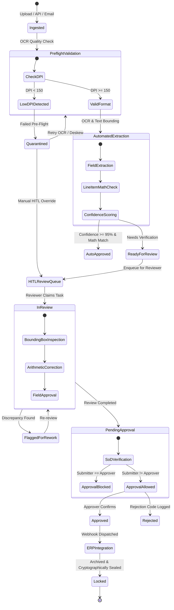
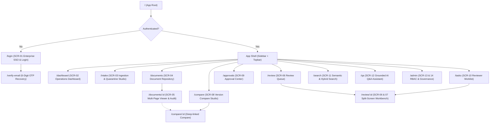
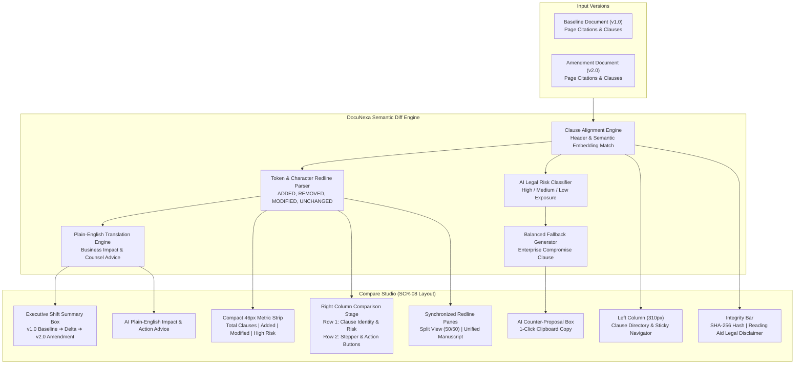
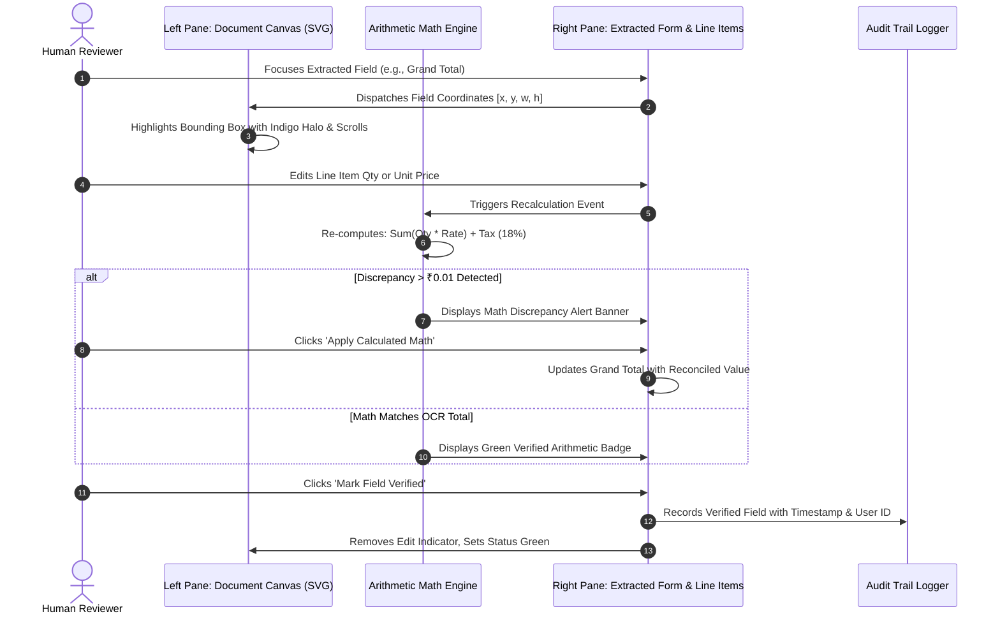
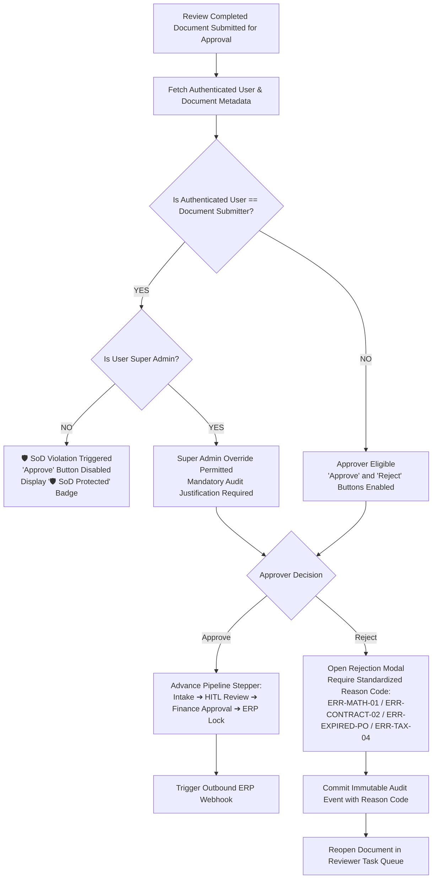
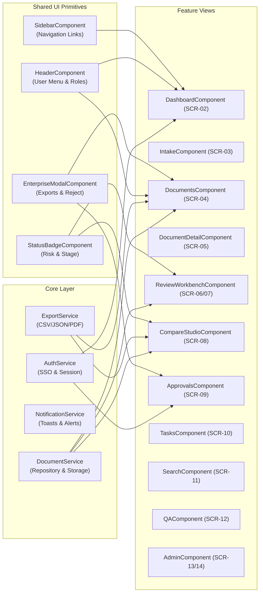
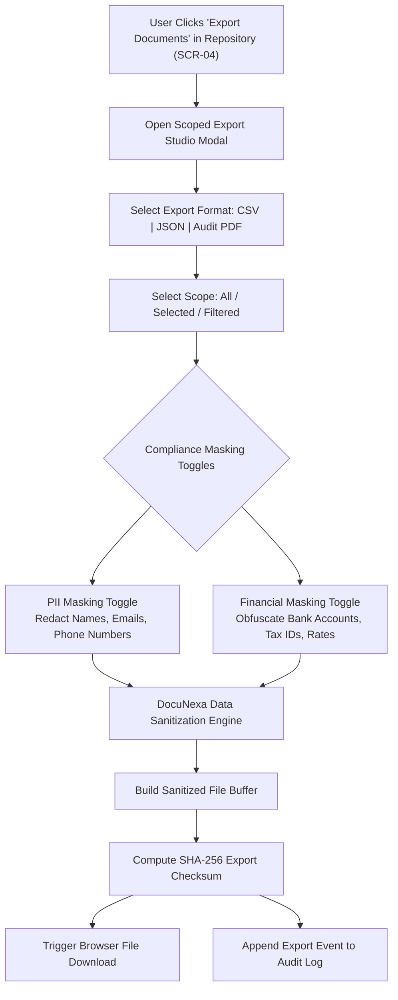
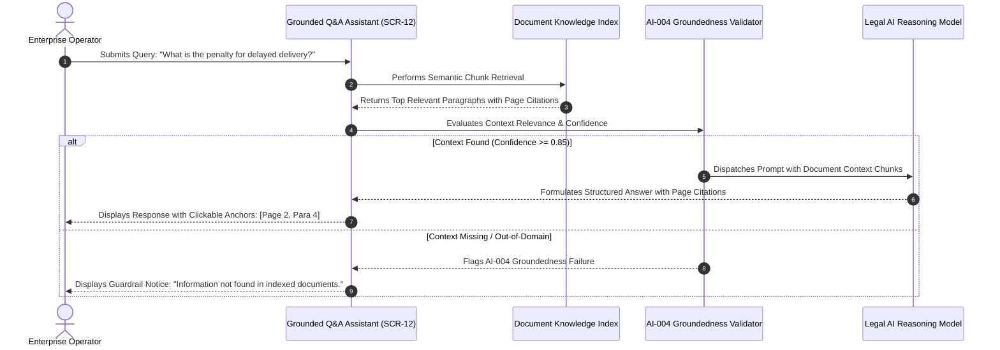

# DocuNexa Platform — Project Graphify & Process Diagrams

This document contains visual diagrams, state machines, architecture graphs, and execution workflows for the **DocuNexa Document Intelligence Platform**, generated using standard Mermaid graph syntax.

---

## 1. End-to-End Document Ingestion & Lifecycle State Machine

---

## 2. Frontend Routing Topology & SPA Navigation Graph

---

## 3. Compare Studio Architecture & Semantic Diff Flow (Task 7D BRD)

---

## 4. HITL Review Workbench & Coordinate Projection Graph (SCR-06 & SCR-07)

---

## 5. Separation of Duties (SoD) & Multi-Stage Approval Decision Graph

---

## 6. Frontend Component Architecture & Dependency Graph

---

## 7. Scoped Export & PII Masking Security Flow

---

## 8. AI Groundedness Guardrail (AI-004) Flow

