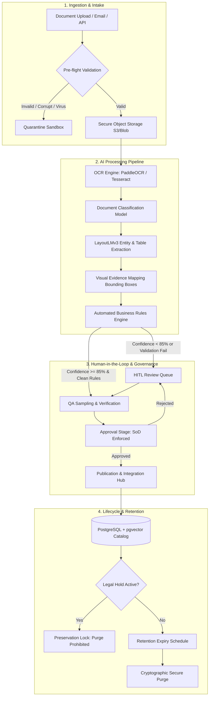

# 01. Project Overview — DocuNexa Document Intelligence Platform

## Executive Summary
**DocuNexa** is an enterprise-grade, multi-tenant Document Intelligence and Lifecycle Governance Platform engineered to automate high-volume document ingestion, optical character recognition (OCR), layout-aware extraction, validation, human-in-the-loop (HITL) review, quality assurance (QA), and multi-step governance approvals.

Built for mission-critical industries—including financial institutions, logistics carriers, procurement enterprises, and legal counsels—DocuNexa bridges legacy unstructured documents (PDFs, TIFFs, scanned PNGs) with structured business intelligence systems (ERPs, CRMs, data lakes).

---

## The Problem DocuNexa Solves
Enterprise organizations process tens of thousands of complex documents daily. Traditional approaches suffer from critical flaws:
1. **Manual Data Entry Bottlenecks**: High operating costs, 3–8% manual keystroke error rates, and 24–48 hour turnaround delays.
2. **Brittle Rule-Based OCR**: Inability to handle rotated, skewed, low-contrast, or heterogeneous vendor layouts.
3. **Absence of Grounded Traceability**: Traditional AI solutions output data without provable source evidence, creating severe legal and audit compliance risks.
4. **Lack of Dual-Control Governance**: Absence of strict Separation of Duties (SoD) between data reviewers and transaction approvers leads to internal fraud risks.
5. **Regulatory & Retention Violations**: Inability to systematically enforce compliance-driven retention schedules, litigation legal holds, and cryptographically verified secure purges.

DocuNexa resolves these challenges through an end-to-end automated pipeline with human-in-the-loop safeguards, visual bounding-box evidence mapping, and cryptographic auditability.

---

## User Personas & Target Roles

| Persona | Primary Focus & Capabilities | Daily Workflow |
| :--- | :--- | :--- |
| **Intake Clerk / Ingestion Operator** | High-volume batch ingestion, drag-and-drop intake, quarantined quarantine inspection. | Monitors upload batches, re-runs OCR on noisy scans, tags document categories. |
| **Document Reviewer (HITL Specialist)** | Data validation, side-by-side split-screen extraction correction, bounding-box verification. | Resolves low-confidence fields (<85%), reviews extracted key-value pairs, flags line-item discrepancies. |
| **QA Auditor / Compliance Specialist** | Quality assurance sampling, validation rules enforcement, audit logging verification. | Randomly samples approved documents, validates math reconciliations, flags compliance issues. |
| **Authorizer / Business Approver** | Multi-level financial & operational sign-off, Separation of Duties enforcement. | Reviews documents >$50,000 threshold, approves or rejects with mandatory audit commentary. |
| **System Administrator & Security Officer** | Multi-tenant governance, API key management, retention schedules, legal holds, audit trails. | Manages tenants, configures webhooks, sets retention policies, initiates litigation holds. |

---

## Supported Document Types & Formats
* **Invoices & Commercial Bills**: Invoices, purchase orders, credit memos, bills of lading, utility bills, receipts.
* **Legal & Corporate Agreements**: Master Service Agreements (MSAs), Non-Disclosure Agreements (NDAs), Statements of Work (SOWs), lease agreements, compliance contracts.
* **Financial & Tax Records**: Balance sheets, W-9/W-2 tax forms, bank statements, audited P&L statements.
* **Identity & Compliance Records**: Government photo IDs, passports, certificates of incorporation, KYC utility proofs.
* **Supported MIME Types**: `application/pdf`, `image/tiff`, `image/png`, `image/jpeg`, `application/vnd.openxmlformats-officedocument.wordprocessingml.document` (DOCX). Max file size: 50MB per document; up to 100 pages per PDF.

---

## Why AI is Leveraged in DocuNexa
DocuNexa does not treat AI as a decorative chatbot; it embeds specialized AI models across 4 distinct processing tiers:
1. **Layout-Aware Vision Models**: Preserves tabular grid structure and multi-column document geometry using deep vision transformers (LayoutLMv3) rather than naive flat text scrapers.
2. **Contextual Key-Value & Entity Extraction**: Discovers semantic keys even when vendor nomenclature shifts (e.g., "Grand Total", "Amount Due", "Net Payable", "Balance").
3. **Grounded Bounding-Box Evidence**: Every single extracted field is pinned to normalized page coordinates `{ x, y, width, height, pageNumber }`. If the system cannot visually highlight the source snippet, confidence drops to zero.
4. **Semantic Vector Search & Grounded Q&A**: Employs pgvector dense embeddings with hybrid BM25 full-text indexing, backed by strict citation retrieval to eliminate hallucinations.

---

## End-to-End System Processing Lifecycle

---

## Detailed Lifecycle Stages

### 1. Document Upload & Ingestion
Documents arrive via Web Portal UI, native iOS mobile scanner, email connector, or REST API. Files undergo cryptographic SHA-256 checksum calculation, ClamAV antivirus scanning, magic-byte MIME type validation, and metadata extraction. Clean files are stored in AES-256 encrypted storage; quarantined files are isolated.

### 2. OCR & Layout Extraction
High-resolution rasterization generates normalized 300 DPI page canvases. The OCR engine generates character-level bounding polygons, spatial coordinates, and line tokens. Layout transformers group tokens into structural hierarchies (headers, key-value pairs, nested tables).

### 3. Visual Evidence Mapping
Every extracted scalar and table cell is tied to a normalized polygon on the canvas. When an operator clicks "Invoice Total: $4,520.00" in the web UI, the document viewer instantly pans and highlights the exact bounding box on Page 1.

### 4. Human-in-the-Loop (HITL) Review
Low-confidence items (<85%), missing mandatory fields, or documents with mathematical discrepancies (e.g., Subtotal + Tax ≠ Total) are routed to the Review Queue. Reviewers use split-screen synchronized viewers to accept, adjust, or re-draw bounding boxes.

### 5. Quality Assurance (QA) Workflow
Randomized sampling (configurable 5%–100%) and all high-risk documents are routed to senior QA Auditors. QA specialists verify review accuracy, calculate team error rates, and enforce data precision standards.

### 6. Approval & Separation of Duties (SoD)
Financial and contractual documents undergo multi-tier approval. The system strictly enforces Separation of Duties: the user who uploaded or reviewed the document cannot approve it. Approvers review side-by-side diffs and audit trails before signing off.

### 7. Publication & Downstream Integrations
Approved documents are marked as **Published**. Webhook notifications and REST events push normalized JSON payloads into customer ERPs (SAP, NetSuite, Salesforce). Documents are indexed into full-text search and vector catalogs.

### 8. Version Comparison Studio
When new revisions of documents arrive (e.g., Contract Amendment v2), the Comparison Studio executes side-by-side visual overlays, structural AST diffs, and clause-level additions/deletions comparisons.

### 9. Retention, Legal Hold & Secure Purge
Documents inherit retention policies (e.g., 7-year financial retention). Active litigation triggers Legal Holds, freezing deletion timers across databases and object stores. Expired records undergo cryptographic zero-fill shredding with immutable purge certificates.
