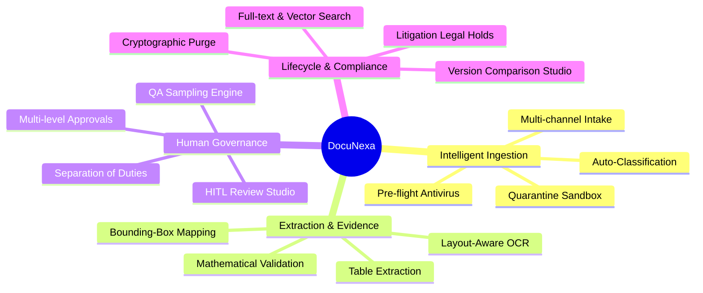

# 02. Product Overview — DocuNexa

## Product Vision & Strategy
DocuNexa delivers a unified, enterprise-grade Document Intelligence Platform that transforms unstructured documents into actionable, auditable business data with zero compromise on precision, governance, or security.

---

## Core Product Pillars

---

## Detailed Feature Matrix

### 1. Unified Dashboard & Operational Intelligence
* Real-time metrics: Ingestion throughput, review queue backlog, approval pipeline, and average processing latency.
* Confidence heatmaps across document types.
* Exception alert banners for failed OCR, quarantine violations, or SoD compliance alerts.

### 2. Intake Studio & Quarantine Management
* Bulk drag-and-drop file uploader with chunked multi-part uploading.
* Pre-flight quarantine isolation with visual quarantine tags.
* Batch re-triggering and exception resolution.

### 3. Human-in-the-Loop (HITL) Review Workbench
* Synchronized split-screen workspace: Interactive high-res PDF canvas on the left, structured metadata form on the right.
* Bidirectional focus: Clicking a field in the form centers and highlights the source bounding box; clicking a bounding box focuses the form input.
* Interactive bounding-box re-drawing for OCR correction.
* Math Reconciliation Validator: Real-time verification of line-item sum against subtotal, tax calculations, and final grand total.

### 4. Comparison Studio (Version Diff)
* Side-by-side visual diff of document revisions (v1 vs v2).
* Color-coded text overlays: Green (Added), Red (Removed), Yellow (Modified).
* Tabular diff for line-item schedule adjustments across contract addendums.

### 5. Multi-Stage Approvals Studio
* Dynamic approval routing based on dollar thresholds and document classifications.
* Cryptographic enforcement of Separation of Duties (Maker-Checker principle).
* Immutable audit trail logging approver identity, IP, timestamp, and decision notes.

### 6. Grounded Q&A and Conversational Search
* Natural language querying across repository documents.
* Strict grounding: Answers reference verified document citations with direct page numbers and snippet quotes. Zero hallucination tolerance.
* Hybrid search: Combines BM25 lexical keyword matching with 1536-dimensional vector similarity.

### 7. Governance, Admin & Compliance Studio
* Multi-tenant organization isolation.
* Granular Role-Based Access Control (RBAC) with 6 pre-built roles and custom permission sets.
* Retention policy scheduler with automatic countdowns.
* One-click Legal Hold enforcement locking documents against shredding.
* Cryptographic purge engine generating downloadable deletion attestations.

---

## Target Industry Verticals & Use Cases

| Vertical | Primary Documents | Key Value Delivered |
| :--- | :--- | :--- |
| **Banking & Financial Services** | Loan applications, W-2s, audited statements, mortgages. | 80% reduction in underwriting turnaround; 100% audit compliance. |
| **Procurement & Supply Chain** | Vendor invoices, Bills of Lading, Purchase Orders. | Automated 3-way matching; real-time invoice math validation. |
| **Legal & Regulatory Compliance** | MSAs, NDAs, litigation filings, compliance disclosures. | Version comparison redlining; automated legal hold enforcement. |
| **Healthcare & Insurance** | Medical claims, intake forms, policy applications. | HIPAA-compliant PII redacting; visual evidence verification. |
