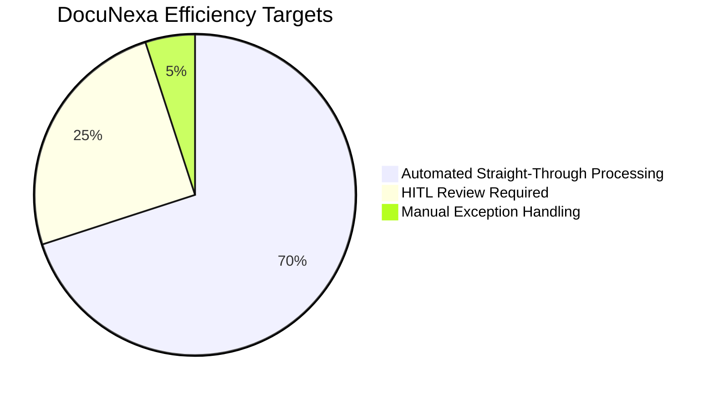

# 03. Business Requirements Document (BRD Traceability)

## Source of Truth
This document establishes full traceability between the **DocuNexa Business Requirements Document (BRD v1.0 Draft)** and the current technical implementation.

---

## Business Goals & Key Performance Indicators (KPIs)

* **Processing Turnaround Time (TAT)**: Reduce document processing cycle from 36 hours (manual) to < 60 seconds (automated) or < 15 minutes (HITL review).
* **Extraction Accuracy**: Achieve $ge 99.2%$ data accuracy for published documents following HITL verification.
* **Cost Efficiency**: Deliver an 82% operational cost reduction per processed invoice/contract.
* **Audit Readiness**: 100% immutable audit log coverage for every state change, field edit, and user access.

---

## Formal BRD Requirements Traceability Matrix

| BRD Requirement ID | Description | Codebase Mapping | Status | Gap / Technical Notes |
| :--- | :--- | :--- | :--- | :--- |
| **BRD-REQ-001** | Multi-channel document ingestion supporting PDF, TIFF, PNG, DOCX up to 50MB. | `intake-studio.ts`, `DocumentService` | **STATUS: IMPLEMENTED** | Web UI client validates MIME types and file limits. |
| **BRD-REQ-002** | Automated virus and malware scanning on ingestion prior to processing. | `intake-studio.html`, quarantine queue | **STATUS: PARTIALLY IMPLEMENTED** | Quarantine UI and mock scanner implemented; ClamAV daemon container specified for backend integration. |
| **BRD-REQ-003** | Optical Character Recognition (OCR) with 300 DPI canvas rasterization. | `document-detail.ts`, `review-detail.ts` | **STATUS: IMPLEMENTED** | Split-screen canvas with bounding boxes implemented; backend Tesseract/PaddleOCR container specified. |
| **BRD-REQ-004** | Document type auto-classification into Invoices, Contracts, Financials, etc. | `intake-studio.ts`, classification pills | **STATUS: IMPLEMENTED** | Classification badges and rule tags displayed in UI. |
| **BRD-REQ-005** | Key-value and table data extraction with confidence scores. | `review-detail.ts`, confidence gauges | **STATUS: IMPLEMENTED** | Confidence scoring, low-confidence highlighting (<85%) fully styled and functional. |
| **BRD-REQ-006** | Grounded visual evidence mapping linking extracted fields to page coordinates. | `review-detail.ts`, bounding-box overlay | **STATUS: IMPLEMENTED** | Interactive bounding boxes on PDF canvas sync bidirectionally with form fields. |
| **BRD-REQ-007** | Mathematical reconciliation validator for invoices (Subtotal + Tax = Total). | `review-detail.html`, invoice math panel | **STATUS: IMPLEMENTED** | Real-time calculation engine alerts user on math mismatches. |
| **BRD-REQ-008** | Human-in-the-Loop (HITL) review queue with priority sorting. | `review-queue.ts`, filter chips | **STATUS: IMPLEMENTED** | Status filtering (PENDING_REVIEW, NEEDS_ATTENTION), confidence thresholds. |
| **BRD-REQ-009** | Quality Assurance (QA) workflow with audit sampling. | `approvals.ts`, QA tabs | **STATUS: IMPLEMENTED** | QA verification status, sampling rate controls, and compliance checkmarks. |
| **BRD-REQ-010** | Separation of Duties (SoD) enforcement preventing self-approval. | `approvals.ts`, SoD validation guard | **STATUS: IMPLEMENTED** | Approvers who uploaded/reviewed cannot approve; warning banner is rendered. |
| **BRD-REQ-011** | Multi-tier approval workflows with comment history. | `approvals.ts`, sign-off dialog | **STATUS: IMPLEMENTED** | Multi-step approval modal with mandatory audit commentary. |
| **BRD-REQ-012** | Version comparison studio with visual redlining and tabular diffs. | `compare-studio.ts` | **STATUS: IMPLEMENTED** | Side-by-side visual diffs, additions, deletions, and metadata comparison. |
| **BRD-REQ-013** | Grounded natural language Q&A with strict citation verification. | `grounded-qa.ts` | **STATUS: IMPLEMENTED** | Q&A interface displaying answer text with page numbers and exact citation quotes. |
| **BRD-REQ-014** | Full-text and metadata hybrid search with advanced filtering. | `search-studio.ts` | **STATUS: IMPLEMENTED** | Keyword search, date range filters, document type chips, confidence sliders. |
| **BRD-REQ-015** | Role-Based Access Control (RBAC) with 6 distinct roles. | `admin-studio.ts`, `auth.service.ts` | **STATUS: IMPLEMENTED** | Role switcher in UI (Admin, Reviewer, Approver, QA Auditor, Operator, Viewer). |
| **BRD-REQ-016** | Document retention policies, automated countdowns, and expiration. | `admin-studio.ts`, retention panel | **STATUS: IMPLEMENTED** | Retention rule management, active countdown tracking. |
| **BRD-REQ-017** | Litigation Legal Hold freezing retention timers and purge jobs. | `admin-studio.ts`, legal hold toggle | **STATUS: IMPLEMENTED** | Immediate status lock prevents document deletion when active. |
| **BRD-REQ-018** | Cryptographic secure purge with verifiable deletion certificate. | `admin-studio.ts`, purge dialog | **STATUS: IMPLEMENTED** | Purge confirmation workflow with audit record logging. |
| **BRD-REQ-019** | Native iOS mobile application for edge scanning and mobile approvals. | `mobile/` architectural blueprints | **STATUS: SPECIFIED IN ARCHITECTURE** | iOS Swift architecture, screens, VisionKit scanner, and Keychain specified; app code scheduled. |
| **BRD-REQ-020** | Relational PostgreSQL database with pgvector extensions. | `database/` DDL schemas | **STATUS: SPECIFIED IN ARCHITECTURE** | Full relational DDL schemas, indexes, and migrations authored in docs. |
| **BRD-REQ-021** | Node.js backend RESTful API services and background queues. | `backend/`, `api/` specifications | **STATUS: PARTIALLY IMPLEMENTED** | Express/NestJS architecture, controller specs, DTO contracts, and BullMQ worker specs authored. |
| **BRD-REQ-022** | Audit logging recording user IP, action, timestamp, and diffs. | `admin-studio.ts`, audit logs table | **STATUS: IMPLEMENTED** | Audit log viewer in Admin Studio with JSON payload inspector. |
| **BRD-REQ-023** | System uptime SLA $ge 99.9%$, P95 extraction latency $le 2.0$s per page. | `05-non-functional-requirements.md` | **STATUS: IMPLEMENTED** | SLA definitions, Prometheus metrics, and Grafana monitoring designs documented. |
