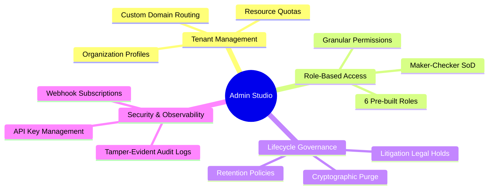

# Admin Architecture & Multi-Tenant Governance

## Administrative Subsystems
The Admin Studio provides centralized operational control across tenants, policies, and system reliability:

---

## Multi-Tenancy Isolation Model
* **Shared Process, Isolated Data**: All tenants share compute clusters while database rows are strictly isolated using `tenant_id` foreign keys combined with PostgreSQL Row-Level Security (RLS) policies.
* **Storage Isolation**: Object storage keys are structured as `s3://{bucket}/{tenant_id}/{document_id}/{filename}` with pre-signed URL validation.
