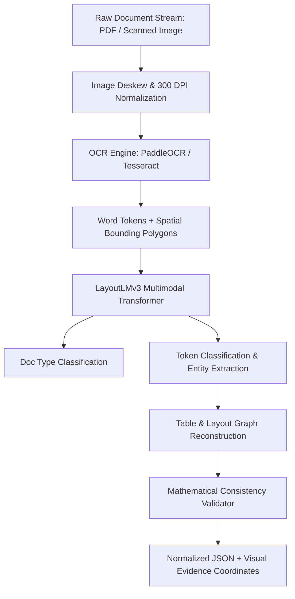

# AI Architecture Specification — LayoutLMv3 & Vision Pipeline

## Multi-Stage Processing Pipeline
DocuNexa utilizes a 4-tier pipeline combining high-resolution visual processing with multimodal deep transformers:

---

## Model Specifications
* **OCR Layer**: PaddleOCR v4 / Tesseract 5.3 producing normalized coordinates $left[x_0, y_0, x_1, y_1
ight]$.
* **Layout & Extraction Layer**: Fine-tuned LayoutLMv3 trained on invoices, tax forms, and legal agreements.
* **Embedding Model**: `text-embedding-3-small` (1536 dimensions) for semantic retrieval.
* **Grounding Engine**: Exact bounding-box spatial association ensuring all answers are tied to visual source pixels.
