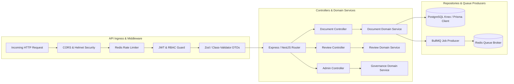

# Backend Architecture Specification — Node.js Services

## Architecture Overview
The backend tier of DocuNexa is designed around high-performance Node.js micro-services using TypeScript. It provides a hardened RESTful API surface, event publishing, and distributed worker pipelines.

---

## Core Backend Subsystems
1. **Document Controller & Service**: Manages document upload initiation, pre-signed upload URLs, metadata updates, and state transitions (`UPLOADED` $
ightarrow$ `PROCESSING` $
ightarrow$ `PENDING_REVIEW` $
ightarrow$ `APPROVED` $
ightarrow$ `PUBLISHED`).
2. **Review & HITL Service**: Exposes endpoints for fetching page OCR bounding boxes, updating field values, and saving reviewer audit stamps.
3. **Separation of Duties (SoD) Engine**: Validates that approvers have zero historical review or upload entries on the document ID.
4. **BullMQ Queue Workers**: Distributed background consumers executing OCR, layout extraction, embedding generation, and webhook dispatching.
