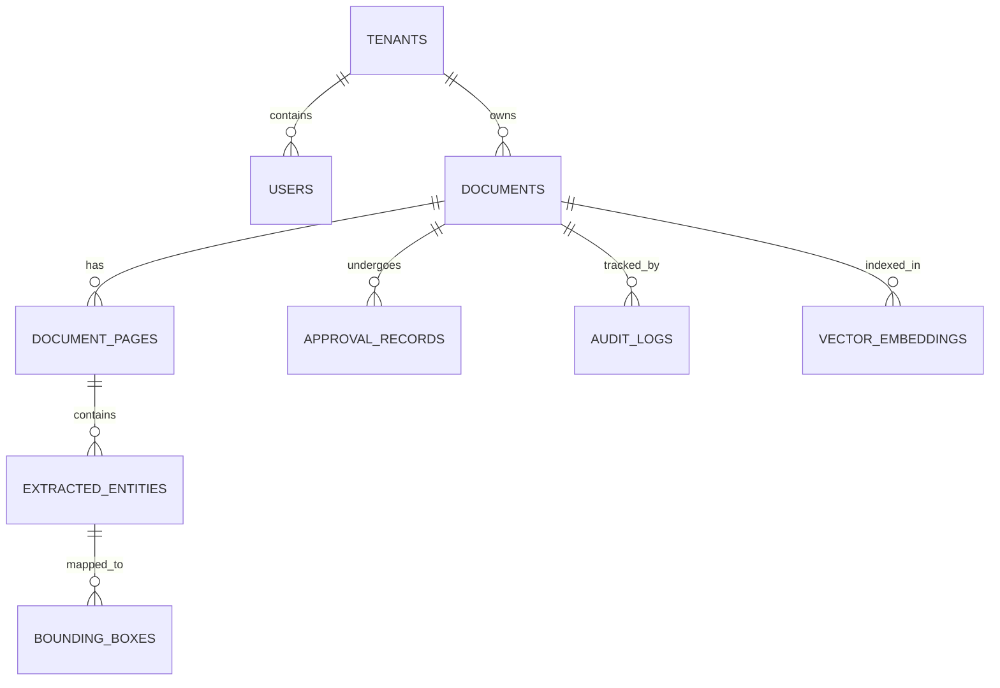

# Database Architecture Specification — PostgreSQL 16 & pgvector

## Database Engine & Extensions
* **Core Engine**: PostgreSQL 16.4 Enterprise Edition.
* **Extensions Enabled**:
  * `uuid-ossp` / `pgcrypto`: UUID generation and cryptographic hashing.
  * `pgvector`: 1536-dimensional vector embeddings for semantic document search.
  * `pg_trgm`: Trigram indexing for fuzzy text searching and OCR typo tolerance.

---

## Storage & Partitioning Strategy
* **Audit Logs Partitioning**: The `audit_logs` table is partitioned by month (`RANGE (created_at)`) to support multi-terabyte log retention with sub-millisecond query performance.
* **Vector Indexing**: Employs Hierarchical Navigable Small World (HNSW) indexing on `vector_embeddings` with cosine distance (`vector_cosine_ops`) for high-throughput semantic querying.
