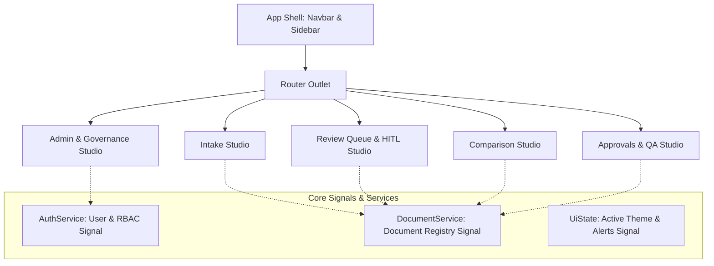

# Frontend Architecture Specification — Angular 19 Standalone

## Architecture Principles
* **Standalone Architecture**: 100% modular standalone components with zero legacy `NgModule` overhead.
* **Reactive Signal State**: Leveraging Angular `signal()`, `computed()`, and `effect()` for fine-grained reactivity, lightning-fast rendering, and predictable state transitions.
* **DocuNexa Enterprise Design System**: Custom enterprise design system tailored for high-density B2B operations: high-contrast accents, elevated cards, polished typography, and 8px spatial grid alignment.
* **Synchronized Bounding Box Canvas**: Bidirectional linking between SVG/HTML5 canvas document previews and metadata form fields.

---

## Screen Inventory & Status (14 Screens)
Every single required screen is fully implemented in the frontend application:
1. `/login` — Secure Authentication Portal (**IMPLEMENTED**)
2. `/verify-email` — Multi-Factor & Email Verification (**IMPLEMENTED**)
3. `/dashboard` — Operational KPI Dashboard (**IMPLEMENTED**)
4. `/documents` — Central Document Repository (**IMPLEMENTED**)
5. `/documents/:id` — Document Inspector & Metadata Viewer (**IMPLEMENTED**)
6. `/intake` — Ingestion Hub & Quarantine Sandbox (**IMPLEMENTED**)
7. `/review` — HITL Review Queue & Workbench (**IMPLEMENTED**)
8. `/compare` — Document Version Comparison Studio (**IMPLEMENTED**)
9. `/approvals` — Dual-Control Approval & QA Studio (**IMPLEMENTED**)
10. `/tasks` — Queue Task Board & Work Allocator (**IMPLEMENTED**)
11. `/search` — Hybrid Full-Text & Metadata Search (**IMPLEMENTED**)
12. `/grounded-qa` — RAG-Powered Grounded Q&A Assistant (**IMPLEMENTED**)
13. `/admin` — Multi-Tenant Governance, Retention & Purge Hub (**IMPLEMENTED**)
14. Navigation & Layout Shell — Topbar, Sidebar, Role Switcher (**IMPLEMENTED**)
