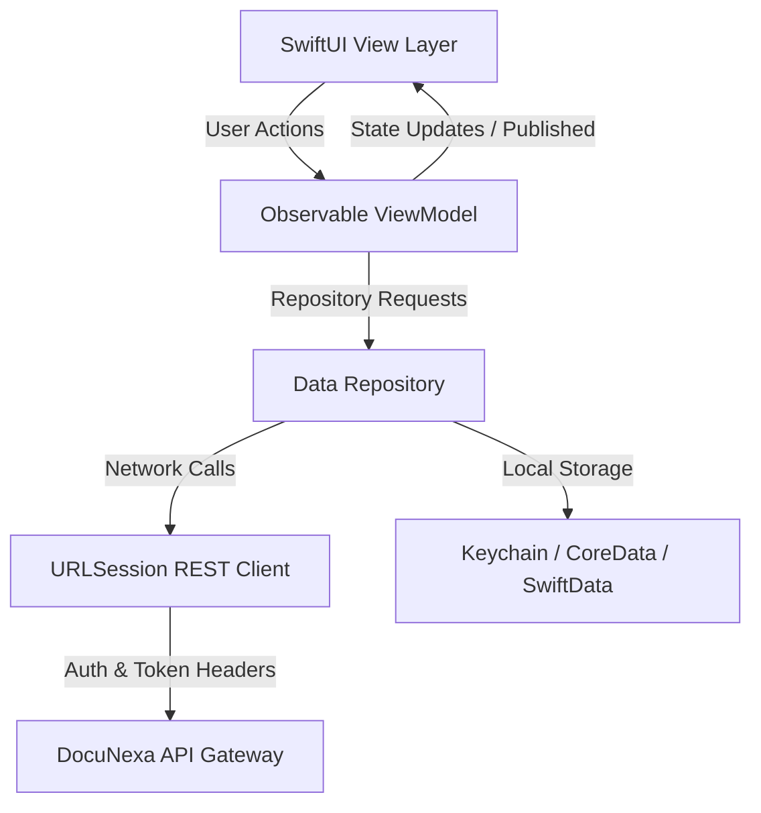

# Native iOS Mobile Architecture Specification

## Architectural Pattern: MVVM + Combine
The DocuNexa iOS application is designed using native Swift, SwiftUI, and Combine, targeting iOS 17+.

---

## Core Mobile Modules
1. **VisionKit Document Scanner**: Uses Apple's native `VNDocumentCameraViewController` for automated edge detection, perspective skew correction, and multi-page batch scanning.
2. **Biometric Authentication (LocalAuthentication)**: FaceID / TouchID biometric unlocking backed by secure token storage in Apple Secure Enclave / Keychain.
3. **Mobile HITL & Approvals**: Optimized card-based swipe gestures for rapid document sign-offs and push notification reviews.
4. **Offline Sync & Storage**: Local encrypted caching using SwiftData with background URLSession sync when network connectivity is restored.
