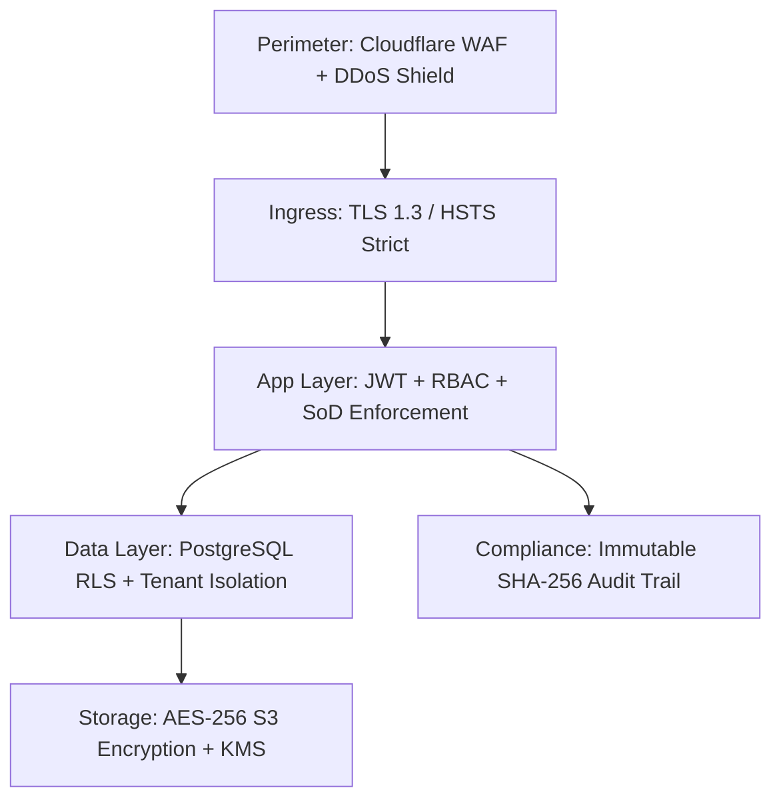

# Security Architecture Specification — Zero Trust

## Security Core Principles
DocuNexa implements a Defense-in-Depth, Zero-Trust security model across every layer of the technology stack:

---

## Cryptographic Controls
* **Separation of Duties (SoD)**: Cryptographically verified maker-checker controls prevent transaction fraud.
* **Legal Hold Lock**: Immutable flag preventing data deletion or modification across all APIs.
* **Secure Purge**: Department of Defense (DoD 5220.22-M) compliant cryptographic data sanitization producing verifiable audit certificates.
