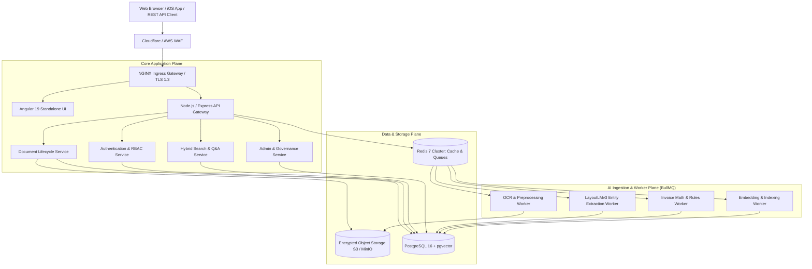

# System Architecture Specification — DocuNexa

## High-Level Topology
DocuNexa is architected as an enterprise-grade, distributed, cloud-native Document Intelligence Platform. It features a modern decoupled topology separating real-time user-facing gateways from asynchronous, compute-heavy AI extraction pipelines.

---

## Architectural Principles
1. **Decoupled Asynchronous Processing**: Time-consuming OCR and deep learning models are decoupled via Redis-backed BullMQ queues to ensure zero UI thread blocking and sub-150ms HTTP API responses.
2. **Stateless Service Layer**: All backend services are completely stateless, allowing frictionless horizontal auto-scaling based on CPU load and queue depth.
3. **Defense-in-Depth Security**: Strict multi-tenant isolation, database row-level security (RLS), signed short-lived S3 URLs, and cryptographic audit trails.
4. **Resilient Event-Driven Communication**: Services emit domain events (e.g., `DOCUMENT_UPLOADED`, `OCR_COMPLETED`, `REVIEW_SUBMITTED`, `DOCUMENT_APPROVED`) enabling modular plug-and-play integrations.
